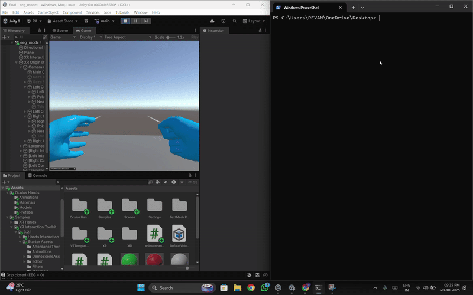

# 🚀 VR-Based Stroke Rehabilitation System Using EEG-Driven Hand Gesture Recognition

This project implements an immersive **Virtual Reality rehabilitation system** that helps stroke patients practice hand movements using a combination of **Meta Quest VR hand tracking** and **EEG-based gesture recognition**.  
The system recreates **open palm** and **close palm** gestures in VR using real-time EEG signals streamed from Python to Unity via **UDP communication**, while also tracking **wrist rotation movements** for motor recovery analysis.

---

## 🧠 Project Overview

The goal of this project is to create a user-friendly, futuristic sci-fi virtual environment where stroke patients can perform therapeutic hand exercises.  
The system supports:
- EEG-driven control of hand gestures  
- XR-based wrist rotation tracking  
- Real-time VR interaction  
- Engaging sci-fi visuals for improved patient motivation  

---

## ✨ Key Features

### 🎮 1. Sci-Fi Rehabilitation Environment
- Futuristic VR world with neon lighting, holographic objects, and interactive elements  
- Designed to reduce therapy fatigue through gamified tasks  

### ✋ 2. Real-Time Hand Rotation Tracking (Meta Quest)
Tracks wrist rotation for rehabilitation metrics:
- **X-axis:** flexion / extension  
- **Y-axis:** pronation / supination  

### 🔌 3. EEG-Driven Gesture Recognition
- EEG model (from collaborator) outputs a **0–1 probability**  
- Enables neuro-control for patients with limited mobility  

### 📡 4. UDP Communication Pipeline
- Python script streams EEG values using UDP  
- Unity receives JSON packets asynchronously  
- Low latency (<150 ms) for smooth VR interaction  

### 🎨 5. Hand Animation System
Animator with states:
- `Idle`  
- `OpenPalm`  
- `ClosePalm`  
Transitions triggered directly from EEG classification results.

### 🧩 6. Unity XR Integration
- XR Interaction Toolkit  
- XR Hands for gesture and pose tracking  
- Custom **“eeg” Input Action Map**  
- Supports hybrid physical + EEG-based control  

---

## 🏗️ System Architecture
EEG Device → ML Model → Python UDP Sender → Unity UDP Receiver
→ Gesture Classification → VR Hand Animation System


---

## 🛠️ Technologies Used

| Component | Description |
|----------|-------------|
| **Unity (LTS)** | Main VR engine |
| **C#** | Unity scripts |
| **Python** | EEG streaming and UDP sender |
| **Meta Quest** | VR headset with hand tracking |
| **XR Interaction Toolkit** | VR interaction framework |
| **XR Hands** | Hand pose & joint tracking |
| **UDP Sockets** | Communication pipeline |

---

## ⚙️ Installation & Setup

### 1. Clone the Repository
```bash
git clone https://github.com/yourusername/yourrepo.git
```
### 2. Open Unity Project

- Use Unity LTS version listed above
- Open the project folder
- Install required XR packages:
- XR Interaction Toolkit
- XR Hands
- OpenXR Plugin

### 3. Run the Python UDP Sender

- python udp_eeg_sender.py

### 4. Play the Scene

- Open the SciFiRehab.unity scene
- Press Play
- Wear the Meta Quest headset
- Rotate hands and test EEG-based gesture control

 


### 🎯 Future Enhancements

- Multi-gesture EEG classification (pinch, thumbs-up, point)
- Rehabilitation analytics dashboard
- Dynamic difficulty adjustment
- Multi-level therapy tasks
- Haptic glove integration

